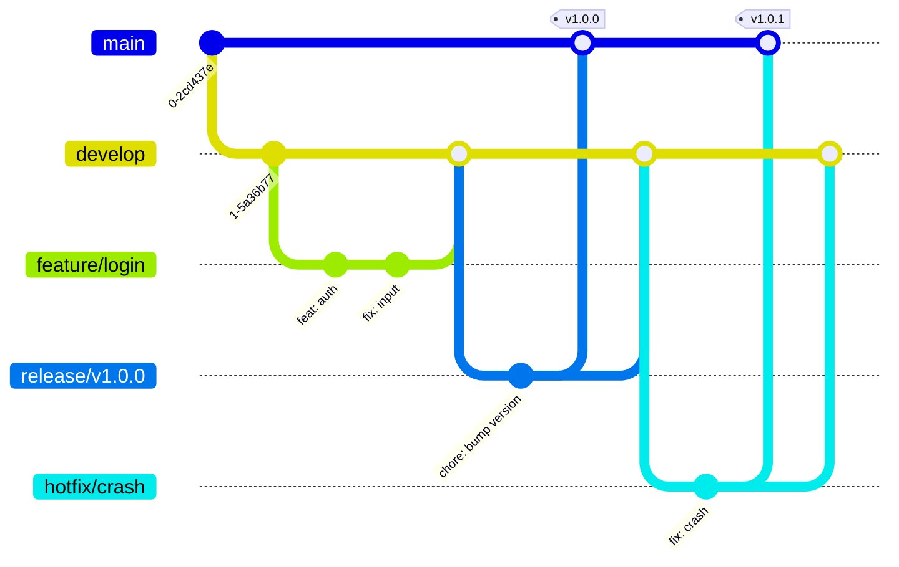

# Config
username: ennbou
respository: smart-cooking-ai

# Git Workflow & Best Practices
 
This document outlines the standard Git workflow and best practices for our team. It is designed to ensure code quality, streamline collaboration, and maintain a clean project history.
 
## Table of Contents
 
1. [Git Best Practices](#git-best-practices)
2. [GitFlow Overview](#gitflow-overview)
3. [Branching Strategy](#branching-strategy)
4. [Commit Guidelines](#commit-guidelines)
5. [Detailed Workflow Instructions](#detailed-workflow-instructions)
6. [Pull Request & Review Process](#pull-request--review-process)
 
---
 
## Git Best Practices
 
Adhering to these practices ensures a healthy codebase and easier debugging.
 
| Practice                     | Description                                                                        | Why it matters                                          |
| :--------------------------- | :--------------------------------------------------------------------------------- | :------------------------------------------------------ |
| **Atomic Commits**           | Make small, focused commits that do one thing.                                     | Easier to revert, review, and understand history.       |
| **Never Commit to `master`** | Always use Pull Requests (PRs).                                                    | Protects production code from unverified changes.       |
| **Keep History Clean**       | Use `rebase` when pulling updates from parent branches (optional but recommended). | Avoids unnecessary merge commits and "railroad tracks". |
| **Review Before Merge**      | All code must be reviewed by at least one peer.                                    | Catches bugs early and shares knowledge.                |
| **Delete Merged Branches**   | Delete local and remote feature branches after merging.                            | Keeps the repository clean and manageable.              |
 
---
 
## GitFlow Overview
 
We follow the **GitFlow** branching model. This provides a robust framework for managing larger projects.
 
### Visual Diagram
 

 
---
 
## Branching Strategy
 
Use consistent naming conventions to identify the purpose of each branch.
 
| Branch Type | Naming Convention         | Source Branch | Merge Target         | Purpose                                           |
| :---------- | :------------------------ | :------------ | :------------------- | :------------------------------------------------ |
| **Main**    | `master` or `main`        | N/A           | N/A                  | Production-ready code. Stable.                    |
| **Develop** | `develop`                 | `master`      | N/A                  | Integration branch for features. Latest dev code. |
| **Feature** | `feature/<ticket>-<name>` | `develop`     | `develop`            | New features or non-critical improvements.        |
| **Bugfix**  | `bugfix/<ticket>-<name>`  | `develop`     | `develop`            | Fixes for bugs found during development.          |
| **Release** | `release/v<x.y.z>`        | `develop`     | `master` & `develop` | Preparation for a new production release.         |
| **Hotfix**  | `hotfix/<ticket>-<name>`  | `master`      | `master` & `develop` | Critical fixes for production issues.             |
 
### Naming Examples
 
- **Feature**: `feature/PROJ-123-user-authentication`
- **Bugfix**: `bugfix/PROJ-456-fix-login-timeout`
- **Release**: `release/v1.2.0`
- **Hotfix**: `hotfix/PROJ-789-payment-gateway-error`
 
---
 
## Commit Guidelines
 
We follow the **Conventional Commits** specification. This leads to more readable messages and allows for automated changelog generation.
 
**Format**: `[<ticket>] <type>(<scope>): <subject>`
 
### Common Types
 
- **feat**: A new feature
- **fix**: A bug fix
- **docs**: Documentation only changes
- **style**: Changes that do not affect the meaning of the code (white-space, formatting, etc)
- **refactor**: A code change that neither fixes a bug nor adds a feature
- **perf**: A code change that improves performance
- **test**: Adding missing tests or correcting existing tests
- **chore**: Changes to the build process or auxiliary tools
 
### Examples
 
- `[KAN-123] feat(auth): add google oauth login support`
- `[KAN-456] fix(ui): resolve button alignment on mobile`
- `[KAN-000] docs(readme): update installation instructions`
- `[KAN-999] chore(deps): upgrade lodash to 4.17.21`
 
---
 
## Detailed Workflow Instructions
 
### 1. Starting a New Feature
 
1.  **Update your local repository**:
    ```bash
    git checkout develop
    git pull origin develop
    ```
2.  **Create a feature branch**:
    ```bash
    git checkout -b feature/my-new-feature
    ```
 
### 2. Working and Committing
 
1.  **Stage changes**:
    ```bash
    git add <file_path>
    # OR add all changes (use carefully)
    git add .
    ```
2.  **Commit changes**:
    ```bash
    git commit -m "feat(api): implement get-user endpoint"
    ```
 
### 3. Keeping Up to Date
 
If `develop` has moved forward while you were working:
 
```bash
git checkout develop
git pull origin develop
git checkout feature/my-new-feature
git rebase develop
# Resolve conflicts if any, then:
git rebase --continue
```
 
### 4. Finishing a Feature
 
1.  **Push your branch**:
    ```bash
    git push -u origin feature/my-new-feature
    ```
2.  **Open a Pull Request (PR)** on GitHub targeting `develop`.
 
### 5. Creating a Release
 
1.  **Create release branch from develop**:
    ```bash
    git checkout develop
    git pull
    git checkout -b release/v1.0.0
    ```
2.  **Perform final touches** (version bumps, changelog updates).
3.  **Merge to Master and Develop**:
    - Open PR from `release/v1.0.0` to `master`.
    - Open PR from `release/v1.0.0` to `develop`.
 
### 6. Hotfixes (Production Issues)
 
1.  **Create hotfix branch from master**:
    ```bash
    git checkout master
    git pull
    git checkout -b hotfix/critical-bug
    ```
2.  **Fix the bug and commit**.
3.  **Merge to Master and Develop**:
    - Open PR from `hotfix/critical-bug` to `master`.
    - Open PR from `hotfix/critical-bug` to `develop`.
 
---
 
## Pull Request & Review Process
 
1.  **Title**: Use the format `[<ticket>] <type>: <subject>` (e.g., `[PROJ-123] feat: add user profile`).
2.  **Description**:
    - **What**: Summary of changes.
    - **Why**: Context or reasoning.
    - **How to Test**: Steps for the reviewer to verify.
    - **Screenshots**: (If UI related) Before/After images.
3.  **Reviewers**: Assign at least one peer.
4.  **Checks**: Ensure CI/CD pipelines (tests, linting) pass.
5.  **Merge**:
    - **Squash and Merge** is preferred for feature branches to keep history linear.
    - **Merge Commit** is preferred for `release` and `hotfix` branches to preserve the flow history.
 