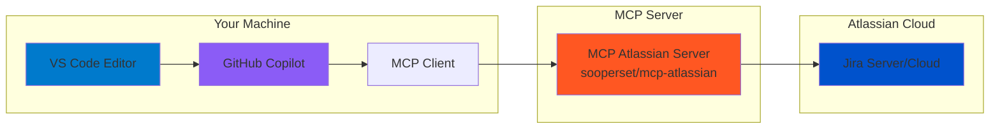

# SmartCook AI - Jira Integration Setup

This project uses GitHub Copilot with MCP (Model Context Protocol) to integrate with Jira for project management and issue tracking.

## Table of Contents
- [Architecture Overview](#architecture-overview)
- [Prerequisites](#prerequisites)
- [Setup Instructions](#setup-instructions)
- [Project Structure](#project-structure)
- [Usage](#usage)

## Architecture Overview



### Data Flow
1. **Developer** writes code and interacts with Copilot in VS Code
2. **GitHub Copilot** processes requests and uses MCP protocol
3. **MCP Client** (built into VS Code) connects to MCP servers
4. **MCP Atlassian Server** (Docker container or NPX) translates requests to Jira API calls
5. **Jira Server** processes queries and returns data

## Prerequisites

- **VS Code** with GitHub Copilot extension
- **Docker Desktop** (recommended) or **Node.js 18+** (for NPX method)
- **Jira Account** (Free plan available)

## Setup Instructions

### Step 1: Create Jira Workspace

1. **Sign up for Jira**:
   - Go to [https://www.atlassian.com/software/jira/free](https://www.atlassian.com/software/jira/free)
   - Click **"Get it free"**
   - Create an account with your email
   - Choose **"Jira Software"** (Free plan includes up to 10 users)

2. **Create your workspace**:
   - Choose a site name (e.g., `yourcompany.atlassian.net`)
   - Select a project template (recommended: **"Scrum"** or **"Kanban"**)
   - Note your **Project Key** (e.g., `COOK`, `SMART`, etc.)

### Step 2: Generate Jira API Token

1. **Go to API Token Management**:
   - Navigate to [https://id.atlassian.com/manage-profile/security/api-tokens](https://id.atlassian.com/manage-profile/security/api-tokens)
   - Click **"Create API token"**
   - Give it a label (e.g., "MCP Atlassian Integration")
   - Copy the token immediately (you won't see it again!)

2. **Save your credentials**:
   - **Email**: Your Atlassian account email
   - **API Token**: The token you just generated
   - **Site URL**: Your workspace URL (e.g., `https://yourcompany.atlassian.net`)

### Step 3: Configure Environment Variables

1. **Duplicate the example file**:
   ```bash
   cd /Users/bouch/Documents/renault/hcktn
   cp .env.example .env
   ```

2. **Edit the `.env` file** with your credentials:
   ```env
   # Jira Configuration
   JIRA_EMAIL=your-email@example.com
   JIRA_API_TOKEN=your_jira_api_token_here
   JIRA_BASE_URL=https://yourcompany.atlassian.net
   JIRA_PROJECTS_FILTER=COOK,SMART  # Optional: comma-separated project keys

   ```

### Step 4: Setup MCP Atlassian Server

#### Docker (Recommended)

1. **Install Docker Desktop**:
   - Download from [https://www.docker.com/products/docker-desktop](https://www.docker.com/products/docker-desktop)
   - Install and start Docker Desktop

2. **Pull the MCP Atlassian image**:
   ```bash
   docker pull sooperset/mcp-atlassian
   ```

3. **Configure VS Code** (open `.vscode/mcp.json`) and click on `start` appears above the `mcp-atlassian`:
   ```json
   {
     "mcpServers": {
       "mcp-atlassian": {
			"command": "docker",
			"args": [
				"run",
				"-i",
				"--rm",
				"--env-file",
				"${workspaceFolder}/.env",
				"ghcr.io/sooperset/mcp-atlassian:latest"
			],
			"type": "stdio"
		}
     }
   }
   ```

## Project Structure

### `.github/instructions/` - AI Assistant Instructions

This folder contains Markdown files that guide GitHub Copilot's behavior:

| File | Purpose | Key Content |
|------|---------|-------------|
| **`git_instructions.instructions.md`** | Git workflow rules | GitFlow model, commit conventions, branching strategy |
| **`jira_backlog.instructions.md`** | Jira ticket templates | Issue types (Feature, Bug, Task, UI), story point guidelines |
| **`project_arch.instructions.md`** | Codebase architecture | Flutter folder structure, Provider pattern, data flow |

**How they work**: These files are automatically loaded by Copilot when you use the `@workspace` context. They help Copilot understand:
- How to create properly formatted Jira tickets
- Which Git workflow to follow
- How the Flutter codebase is organized

### `.github/copilot-instructions.md` - Project Context

This is the main instruction file that gives Copilot comprehensive knowledge about:
- Tech stack (Flutter, Provider, OpenRouter API)
- Architecture patterns (feature-based structure)
- Development workflows (code generation, testing)
- Best practices (state management, error handling)

When you ask questions in Copilot Chat, this file ensures consistent, project-aware responses.

## Usage

### Creating Jira Issues via Copilot

**Example prompts**:

```
Create a Jira feature ticket for implementing dark mode support in the Flutter app
```

```
Create a bug ticket: recipe generation fails when ingredient list is empty
```

```
Search for all open bugs in the COOK project
```

### Searching Jira Issues

```
Show me all high-priority issues in the current sprint
```

```
Find all issues assigned to me that are in progress
```

### Updating Issues

```
Transition issue COOK-123 to "In Progress"
```

```
Add a comment to COOK-456: "Completed testing on iOS device"
```

### Git Workflow with Copilot

Copilot understands the GitFlow pattern from `git_instructions.instructions.md`:

```
@workspace Create a feature branch for the new recipe filtering feature
```

```
@workspace Generate a conventional commit message for these changes
```

## Troubleshooting

### MCP Server Not Connecting

1. **Check Docker is running**: `docker ps` should list running containers
2. **Verify `.env` file exists** and has correct credentials
3. **Check MCP logs**: VS Code > Help > Developer Tools > Console tab
4. **Restart VS Code** completely

### Jira Authentication Errors

1. **Verify API token** is correct (regenerate if needed)
2. **Check email** matches your Atlassian account
3. **Confirm base URL** includes `https://` and `.atlassian.net`
4. **Test manually** using curl:
   ```bash
   curl -u your-email@example.com:YOUR_TOKEN \
     https://yourcompany.atlassian.net/rest/api/3/myself
   ```
